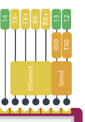

# Lab Notebook

Martin Michalski (martinm6)

### Structure

Titles are dates of meetings or workdays in which our project was worked on. Subsequent text and images
serve to describe work done, design decisions made, or group decisions made as a result of a meeting.

### 2022.08.23

First group meeting. Brainstormed and decided to develop a system for the quick setup of WiFi network.
Discussed the most likely challenges we will face during implementation.

At the conclusion of this meeting we created a post on the Web Board detailing the problem we aim to 
address and a general overview of our proposed system.

### 2022.08.25

Second group meeting. Went into more detail as to potential parts to use for the system nodes and
detailed criterion for success.

At the conclusion of this meeting, we delegated research into subsystems amongst the group members.
 - Mellisa: Sensors
 - Trevor: Battery Management
 - Martin: Routing

Later in the day, I looked into potential ways to provide wireless access to users and route traffic 
through our network, finding potential approaches:
 - Microcontroller + [ESP8266](https://www.espressif.com/en/products/socs/esp8266)
 - [Omega2](https://onion.io/omega2/)
 - [VoCore2](https://vocore.io/v2.html)

After some discussion with the group, we decided to go with one of the computers (Omega2 or VoCore2) due 
their being a bit easier to work with, and comparable in price to the microcontroller option, while
still providing pins to interface with GPS and battery voltage sensors. We chose the Omega2 over VoCore due
to a better level of community support. Price was not a factor, as both chips were rather similarily priced. 
Although we aim to build our system for as cheap as possible, we are more concerned with building a system
that is sure to work and prove our concept due to our only having one semester to complete the system.

### 2022.08.26

Third group meeting. Discussed researched parts and confirmed compatibility in our overall system 
architecture. Drafted and submitted the RFA as a group. 

### 2022.08.29

Fourth group meeting. Discussed important tasks for the week. This week, I will be focusing on:
 - CAD Assignment
 - Frontend for the system monitor

### 2022.09.01

Starting frontend development. Watching a React tutorial to refresh my
knowledge on the topic. Notes on the video can be found below.

React Notes
- Tracks page state via DOM tree, updates only the part of the page that needs updating
- Component-based UI (independent and reusable components)
- Functional components
    - Use any function format present in Javascript
    - Return JSX to render
- Props syntax example  
```javascript
    const Person = (props) => {
        return (
            <>
                <h1>Name: {props.name}</h1>
            </>
        )
    }

    const App = () => {
        return(
            <div className="App">
                <Person name='John' />
            </div>
        )
    }
```
- State in react
    - Have to import: `import { useState } from 'react'`
    - Example declaration of a component state variable: `const [counter, setCounter] = useState(0)`
        - Initial state for the variable is given to the `useState()` function
    - Call the set method as follows: `setCounter((prevCount) => prevCount - 1)`
    - Use the set function, never manipulate state directly
- Reference the [documentation](https://reactjs.org/docs/hello-world.html) for all hooks in react


JSX Notes
- `className` instead of traditional HTML `class`
- Use `{}` to inject javascript values
    - This makes component reactive to data
- `<></>` is an empty fragment
- Always start component names with capital letter

### 2022.09.02

Today I created the general layout for the frontend of the System Monitor. I made an unformatted hamburger menu, as well as
got Google Maps up and running with the styling I wanted.


Also, I met with Trevor to establish a format for the data format from the backend. This is the format for general node
metadata we settled on:

```JSON
{
    <node-id, string>: {
        "id": <node-id, string>,
        "location": {
            "lat": <node-latitude, float>, 
            "lng": <node-longitude, float>
        },
        "voltage": <node-voltage, float>,
        "lastSeen": <node-last-seen-time, unix timestamp>,
        "meshCount": <node-mesh-connections, int>
    }
}
```

We also established a format for getting statistics on "edges" between the nodes:

```JSON
    [
        {
            "ids": [
                <node-id, string>, 
                <node-id, string>
            ], 
            "strength": <connection-strength, float>
        }, ...
    ]
```

### 2022.09.03

Added mock data to the application, and styled the cards in the hamburger menu to display this new data, while including
checks for missing data. 


### 2022.09.09

Created tooltips to display node information right over the nodes icons on the map. Also created state allow 
interactions between the hamburger menu and the maps portion of the site. For example, when a node card is clicked
in the hamburger menu, the map centers on that node and displays its tooltip.


### 2022.09.11

Design validation for the hardware schema Trevor developed. Here I include notes on the circuit subsections
I had time to cover this day.

USB-C Port
- Interface with external power supply, used for the charging of our lithium-ion batteries
- On the issue of grounding, the current design includes a $0 \Omega$ resistor to our battery ground
    - Based on the [discussion](https://electronics.stackexchange.com/questions/389972/usb-shield-to-ground-or-not-to-ground) 
    linked in Trevor's notebook there no one-solution fits all, but participations mention some important considerations
        - Ground on USB slave devices may not be true ground, potentially leading to an unintended induced current between master and slave
            - This is what's referred to as a [ground loop](https://help.campbellsci.com/CR1000X/Content/shared/Maintain/Troubleshooting/ground-loops.htm#:~:text=A%20ground%20loop%20is%20a,potential%20point%20of%20the%20circuit.). This is an issue to be considered
            with our USB design, as with the resistor in place PCB ground is connected to both our local battery 0V, as
            well as the ground of the master charging device. If shielding is connected to ground in both devices, we have a ground loop.
            - The article above recommends leaving the shielding grounded only on one end of the cable
        - In an ideal world, the host should provide the shielding connection to ground, but online discussions serve to prove that
        we do not live in an ideal world
    - Based this [discussion](https://electronics.stackexchange.com/questions/4515/how-to-connect-usb-connector-shield), manufacturers
    give conflicting guidelines.
    - These points in mind, I agree with the $0 \Omega$ resistor option. This was brought up in the discussions as well. It
    affords us flexibility
- Power Specification
    - I read this [discussion](https://electronics.stackexchange.com/questions/511559/type-c-non-negotiated-power-and-20v-protection), no 
    real insight
    - Our device has a UFP (Upstream Facing Port), and will act as a current sink
    - Referring to the [USB spec](https://www.usb.org/document-library/usb-type-cr-cable-and-connector-specification-release-21), 
    Tables 4-25 and 4-24 seem to validate the discussion linked in Trevor's notebook, and the design
- Only potential issue I saw when browsing discussions is that some devices may provide 21V upon connection
    - For this POC, we will make sure to use a charger that does not do this
    - This is out-of-spec, and therefore not worth accounting for
    - We have a fuse in the case of abnormally high current drawn from the host
- NOTE: Make sure to ensure PCB traces can handle the max 15W flow from VBUS

Boost Converter (Old)
- This converter is able to handle $V_{in}$ of up to 24V, therefore the possiblilty of USB providing 24V on connection is not a concern
- Trevor's analysis of $V_{out}$ voltage ranges my independent calculations as well
- Diode selection seems to be in order, with the note that the battery charging cicuit should not draw more than 2A
- This is not the most up to date version of the boost converter
    - Refer to the next section for notes

### 2022.09.22

Implementing the backend. Below are notes written to work with MariaDB database.

Open the database console.
```
mysql -u charm_user -p
```

Opening the database of interest.
```sql
use charm_db;
```

Show all tables in the database.
```
SHOW TABLES;
```

Creation of the nodes table.
```sql
CREATE TABLE nodes (
    id CHAR(9) NOT NULL,
    readable_name VARCHAR(40) NOT NULL
);
```

Add a single row to the nodes table.
```sql
INSERT INTO nodes 
    (id, readable_name) VALUES 
    ('test-1sd4', 'Test Node #2');
```

Remove a row from the nodes table.
```sql
DELETE FROM nodes
    WHERE id='test-1sd4';
```

Creation of the telemetry table.
```sql
CREATE TABLE telemetry (
    id CHAR(9) NOT NULL,
    timestamp INT NOT NULL, 
    lat FLOAT NOT NULL,
    lon FLOAT NOT NULL, 
    voltage FLOAT, 
    clientCount TINYINT, 
    meshCount TINYINT
);
```

Add a single row to the telemetry table.
```sql
INSERT INTO telemetry
    (id, timestamp, lat, lon, voltage, clientCount, meshCount) VALUES 
    ('test-1sd4', 1663899605, 40.115041, -88.227480, 6.575421, 2, 3);
```

Altering some columns to be non-null.
```sql
ALTER TABLE telemetry
MODIFY lat
FLOAT NOT NULL;

ALTER TABLE telemetry
MODIFY lon
FLOAT NOT NULL;
```

Adding an index to the timestamp column s.t. querying for the latest telemetry is efficient.
```sql
ALTER TABLE telemetry
ADD INDEX(timestamp);
```

An interesting extension to this scheme would be the addition of a column to track the time
at which the data is received and updated in the server. This would allow for on-the-fly
latency analysis for each node.

In addition to setting up the databases, I implemented an API endpoint to get information
on all of the nodes currently being tracked.

### 2022.09.24

First, I change the type of some columns to double as opposed to float, since we were having some
precision issues.

```sql
ALTER TABLE telemetry
MODIFY lat
DOUBLE NOT NULL;
```

I then implemented the POST request endpoint to store node telemetry to the server's database.
I tested both POST and GET endpoints with Postman, and validated that the state of the database 
changes as expected.

At this point, all that is left to do is integration of the frontend with the backend, with the
frontend polling the backend for new data every x seconds.

### 2022.10.16

Trevor and I assembled a complete board today. Below is 
the procedure I developed for first time Omega2S setup.

**First Time Omega2S+ Setup Procedure**

1. Power on the Omega2S+
2. Connect to the Omega via WiFi (password: `12345678`)
3. SSH into the Omega
    - `ssh -oHostKeyAlgorithms=+ssh-rsa root@omega-ABCD.local` or ssh `root@omega-ABCD.local`
    - Enter the default password `onioneer`
4. Configure the Omega's WiFi connection by running wifisetup
    - If issues occur, run `wifisetup clear` to clear other networks from the wifi driver
5. Update the Omega's firmware by running `oupgrade`
6. Change the root user password to `onionEngineer` with the `passwd` command while logged in as `root`

## 2022.10.19

**Notes**

The `opgs` package on the Omega does not properly parse NMEA sentences. As a result, I will set up
cross-compilation in order to be able to develop on my PC, and then simply download the executable
on the Omega. This should sped the development process. Instructions for how to set up the build system may
be found in the next section of these notes.

**System Setup for Cross-Compilation**
1. Install Docker if not installed on your system
2. Pull the docker image: `docker pull onion/omega2-source`
3. Run the container: `docker run -it onion/omega2-source /bin/bash`
4. Update the onion package feeds `./scripts/feeds update onion`
5. Update all other package feeds: `./scripts/feeds update -a`
6. Update repository code: `git pull`
7. Compile build system: `export GIT_SSL_NO_VERIFY=1 && make -j 33`

Common issue when trying to compule the build system:
```
[src/util]
make: Entering directory '/root/source/build_dir/target-mipsel_24kc_musl/postfix-3.3.0/src/util'
mipsel-openwrt-linux-musl-gcc -DNO_NIS -DUSE_TLS -DUSE_SASL_AUTH -DUSE_CYRUS_SASL -I/root/source/staging_dir/target-mipsel_24kc_musl/usr/include/sasl -DHAS_LDAP -DHAS_CDB -DNO_DB -DHAS_SQLITE -I/root/source/staging_dir/target-mipsel_24kc_musl/usr/include/ -DHAS_PCRE -I/root/source/staging_dir/target-mipsel_24kc_musl/usr/include/ -DNO_EAI -DDEF_DB_TYPE=\"cdb\"  -g -O -I. -DLINUX5 -c alldig.c
cc1: note: someone does not honour COPTS correctly, passed 0 times
In file included from alldig.c:29:0:
./sys_defs.h:1257:2: error: #error "unsupported platform"
 #error "unsupported platform"
  ^~~~~
./sys_defs.h:1320:2: error: #error "define HAS_FCNTL_LOCK and/or HAS_FLOCK_LOCK"
 #error "define HAS_FCNTL_LOCK and/or HAS_FLOCK_LOCK"
  ^~~~~
./sys_defs.h:1324:2: error: #error "define DEF_MAILBOX_LOCK"
 #error "define DEF_MAILBOX_LOCK"
  ^~~~~
./sys_defs.h:1328:2: error: #error "define INTERNAL_LOCK"
 #error "define INTERNAL_LOCK"
  ^~~~~
./sys_defs.h:1336:2: error: #error "define USE_STATFS or USE_STATVFS"
 #error "define USE_STATFS or USE_STATVFS"
  ^~~~~
In file included from alldig.c:29:0:
./sys_defs.h:1347:57: error: unknown type name 'SOCKADDR_SIZE'
 extern const char *inet_ntop(int, const void *, char *, SOCKADDR_SIZE);
                                                         ^~~~~~~~~~~~~
Makefile:187: recipe for target 'alldig.o' failed
make: *** [alldig.o] Error 1
make: Leaving directory '/root/source/build_dir/target-mipsel_24kc_musl/postfix-3.3.0/src/util'
Makefile:92: recipe for target 'update' failed
make[4]: *** [update] Error 1
make[4]: Leaving directory '/root/source/build_dir/target-mipsel_24kc_musl/postfix-3.3.0'
Makefile:265: recipe for target '/root/source/build_dir/target-mipsel_24kc_musl/postfix-3.3.0/.built' failed
make[3]: *** [/root/source/build_dir/target-mipsel_24kc_musl/postfix-3.3.0/.built] Error 2
make[3]: Leaving directory '/root/source/feeds/packages/mail/postfix'
Command exited with non-zero status 2
time: package/feeds/packages/postfix/compile#0.45#0.11#0.83
package/Makefile:107: recipe for target 'package/feeds/packages/postfix/compile' failed
make[2]: *** [package/feeds/packages/postfix/compile] Error 2
make[2]: Leaving directory '/root/source'
package/Makefile:103: recipe for target '/root/source/staging_dir/target-mipsel_24kc_musl/stamp/.package_compile' failed
make[1]: *** [/root/source/staging_dir/target-mipsel_24kc_musl/stamp/.package_compile] Error 2
make[1]: Leaving directory '/root/source'
/root/source/include/toplevel.mk:216: recipe for target 'world' failed
```

The resolution for this issue is using a simpler, minimal configuration. Switch to a simpler config using
the `python scripts/onion-setup-build.py -c .config.O2-minimum` command.

*The above may also be done via Windows GUI for the most part*

**Setting Up Development Environment for our Code**

1. Configure the image SSH keys to be able to update the remote repository
2. Pull our github repository into the Docker image: `git clone git@github.com:CaptnSisko/CHARM.git`
3. Open up the folder in VSCode or editor/IDE of choice
4. Install `sshpass` with command: `apt-get install sshpass`

## 2022.10.20

The following table was started by me today.

**Charging Subsystem Stress Test**

|Battery Pair|Date|~Charge Time|Prototype Status|Start Voltage|End Voltage|
|:-:|:-:|:-:|:-:|:-:|:-:|
|1|2022.10.19|4h 30m|Stable|3.68V|4.16V|
|2|2022.10.20|4h|Stable|3.63V|4.06V|

Today I started coding a C program to get the voltage from the ADC.

## 2022.10.21

I finished the ADC telemetry software. Writing software to pull data from the GPS. The GPS is represented
as file `/dev/ttyACM0` on the Omega2S+.

Here is the proper compilation command for reference:

```
sh xCompile.sh -buildroot /root/source -lib "oniondebug -lonioni2c"
```

GPS Output Message formats:

|Message Type|Details|
|:-:|:-:|
|GGA|Time, position, and fix related data|
|GLL|Position, time, and status|
|GSA|GPS DOP and number of satellite fixed|
|GSV|Specific satellite ID numbers, metadata|
|RMC|Position, velocity and time|
|VTG|Tracking information|
|TXT|Human readable information|

The information about GPS message types was sourced from 
this [website](https://receiverhelp.trimble.com/alloy-gnss/en-us/NMEA-0183messages_GGA.html).

**NMEA Notes**

Maximum sentence lenth is [82 bytes](https://gpsd.gitlab.io/gpsd/NMEA.html). This reference is used heavily in the 
development of our NMEA message parser.

## 2022.10.22

Today I am performing validation of the mapping between the ADC observed voltage and the true $V_{\text{batt}}$.

**True Voltage v. Measured Voltages**

We test voltages in 0.1V increments in the safe Lithium-ion operating voltage range. (6.0V - 8.4V)
|$V_{\text{batt}}$|$V_{\text{ADC}}$|
|:-:|:-:|
|6.0|1.609, 1.607, 1.609|
|6.1|1.646, 1.647, 1.646|
|6.2|1.688, 1.686, 1.688|
|6.3|1.734, 1.733, 1.732|
|6.4|1.775, 1.777, 1.778|
|6.5|1.817, 1.817, 1.817|
|6.6|1.851, 1.850, 1.850|
|6.7|1.897, 1.897, 1.897|
|6.8|1.940, 1.940, 1.940|
|6.9|1.982, 1.981, 1.982|
|7.0|2.023, 2.023, 2.023|
|7.1|2.069, 2.069, 2.068|
|7.2|2.104, 2.103, 2.103|
|7.3|2.146, 2.146, 2.146|
|7.4|2.184, 2.186, 2.186|
|7.5|2.230, 2.229, 2.230|
|7.6|2.269, 2.270, 2.269|
|7.7|2.313, 2.312, 2.313|
|7.8|2.357, 2.356, 2.357|
|7.9|2.416, 2.415, 2.416|
|8.0|2.414, 2.424, 2.424|
|8.1|2.471, 2.470, 2.469|
|8.2|2.517, 2.517, 2.517|
|8.3|2.559, 2.559, 2.560|
|8.4|2.603, 2.603, 2.603|

The voltages observed do not match our expectation. We will be modifying the ADC script to
account for this and performing validation later.

### 2022.10.22

Followed this (guide)[https://linuxhint.com/install-docker-on-pop_os/]
to install docker on `Pop!_OS`.

We test voltages in 0.1V increments in the safe Lithium-ion operating voltage range. (6.0V - 8.4V)
This time, we are validating that our ADC reading script is able to
properly read the battery voltage across the operating range of the battery.
|$V_{\text{batt}}$|$\hat{V}_{\text{batt}}$|
|:-:|:-:|
|6.0|5.945, 5.957, 5.958|
|6.1|6.051, 6.052, 6.052|
|6.2|6.157, 6.164, 6.163|
|6.3|6.261, 6.263, 6.261|
|6.4|6.369, 6.369, 6.370|
|6.5|6.505, 6.505, 6.505|
|6.6|6.513, 6.513, 6.513|
|6.7|6.661, 6.662, 6.662|
|6.8|6.764, 6.766, 6.767|
|6.9|6.869, 6.870, 6.869|
|7.0|6.968, 6.965, 6.967|
|7.1|7.083, 7.085, 7.085|
|7.2|7.162, 7.162, 7.162|
|7.3|7.275, 7.277, 7.276|
|7.4|7.373, 7.383, 7.381|
|7.5|7.480, 7.481, 7.480|
|7.6|7.585, 7.587, 7.586|
|7.7|7.685, 7.685, 7.685|
|7.8|7.791, 7.790, 7.792|
|7.9|7.929, 7.930, 7.930|
|8.0|7.972, 7.972, 7.972|
|8.1|8.059, 8.060, 8.053|
|8.2|8.179, 8.179, 8.179|
|8.3|8.284, 8.287, 8.286|
|8.4|8.381, 8.380, 8.382|

### 2022.11.04

Met with Jack today and tested all 5 boards which Melissa soldered. When we plugged in
board 3, it produced a high-frequency whine. Upon further testing, we found that the
3.3V rail on the board was shorted. We think the GPS module may be the culprit, but are
not sure.

### 2022.11.05

We found the issue and promplty resolved it.

I am working on porting over the software to OpenWRT. First I am refactoring the software. I tested the
boards along with the rest of the group today. All of the boards seem to be in working order, however
the refactored software is not functioning properly. The boards also appear to have different ADC 
transformation coefficients.

### 2022.11.06

I am working on fixing the bugs I introduced when I refactored the software which collects telemetry
from the boards.

Here is a reference mapping our board numbers to the last 2 bytes of their MAC addresses.

|Board Number|MAC Address Ending Bytes|
|:-:|:-:|
|1|0xA390|
|2|0xA3F0|
|3|0xABD3|
|4|0xAC2D|
|5|0xABA0|

The refactoring bug was very easy to fix. I am now moving on to porting the code
written for OnionOS to OpenWRT. Note on switch position: AWAY from battery holder
is OFF, TOWARDS battery holder is ON.

OpenWRT IP is by default 192.168.1.1. In order to set up a node as the Omega was, i.e. 
a bridge for a network, follow this [guide](https://openwrt.org/docs/guide-user/network/wifi/relay_configuration).
Make sure to do a [soft factory reset](https://openwrt.org/docs/guide-user/troubleshooting/failsafe_and_factory_reset#factory_reset) first. These steps require a serial connection to the device.

First, we set up a wireless access point for the node:

```sh
uci set wireless.radio0.disabled=0
uci commit
wifi
```

### 2022.11.19

Today is the day. I am implementing and testing meshing with the nodes. Below is an 
accounting of OS versions running on the nodes, updated throughout the day
as I work on implementing meshing.

|Node|OS|Serial Available|IP|Notes|
|:-:|:-:|:-:|:-:|:-:|
|1|Vanilla OpenWRT|Y|192.168.10.1|Working, Gateway Node|
|2|Vanilla OpenWRT|Y|192.168.10.2|Working, AP Node|
|3|Custom OpenWRT|Y|192.168.10.3|Blocked, `kmod-batman-adv`|
|4|OnionOS|Y|192.168.10.4|None|
|5|Custom OpenWRT|Y|192.168.10.5|Basic Config, In Use for Software Dev|

**Miscellaneous Notes**

Here are the TX and RX pins on the Omega. When connecting to another
device TX goes to RX on the other device and vice versa.



Switch away from the battery holder is the off position.

Connecting to Omega via serial:

```
ls /dev/ttyUSB*
sudo screen /dev/ttyUSB0 115200
```

***Detailed Account of Actions Taken to Set Up Internet Access***
1. Power on Node 2
2. OpenWRT visible as network.
    - Unable to connect from laptop. Visible.
    - Unable to connect from desktop. Visible.
3. Connect USB to TTY device to laptop
4. `laptop> sudo screen 115200`
5. `node2> firstboot && reboot now`
6. Wait for ~60 seconds, at least ~15 seconds since last kernel output
8. Set password to `onionEngineer`: `node2> passwd`
9. `node2> uci set wireless.radio0.disabled=0`
9. `node2> uci commit`
9. `node2> wifi`
10. Press enter until command line shows up once again.
11. `node2> exit`
12. Disconnect USB device.
13. Connect laptop to `OpenWRT` wifi network.
14. Navigate to `192.168.1.1` in the browser.
15. Reboot the device from the browser (Test for persistence of intial setup). Success after ~90sec.
16. Change LAN Interface IPv4 address to `192.168.2.1`. Master router has IP
`192.168.0.1` in my home. Save and apply. Hit "apply revert on connectivity loss".
17. Disconnect and reconnect to `OpenWRT` wifi
18. Navigate to `192.168.2.1`
19. Reboot to device from the browser (Test for persistence). Success after ~90sec. 
20. Scan for networks, choose home network.
21. Check "Replace wireless configuration".
22. Enter password for the network.
23. Choose "wan" as the firewall zone for the network.
24. Do not make any modifications on the popup which appears afterwards.
25. Save and apply settings. Failed.
26. Wait for rollback. Failed.
27. `OpenWRT` is no longer an available network.
28. Connect USB converter to laptop.
29. `laptop> sudo screen 115200`. Nothing.
30. Hard restart with power switch.
31. Plug in USB.
32. `OpenWRT` now visible.
33. Message in browser about how configuration changes were rolled back.
34. Scan for wireless networks.
35. Choose home network.
36. Input password.
37. Assign to "wan" firewall zone.
38. Leave the rest of the settings to same.
39. Save and apply. Success.
40. Go to Network Diagnostics and perform ping test. Success.
41. Reboot to check for persistence. Success.
42. Internet is accessible from the laptop.
43. This [tutorial](https://openwrt.org/docs/guide-user/network/wifi/relay_configuration) keeps devices connected to `OpenWRT` on the the same subnet
as the original device. These instructions are based on [this tutorial](https://openwrt.org/docs/guide-user/network/wifi/connect_client_wifi#known_issues) instead.
44. 9-10Mb/s on speed test.
45. Go to Network Wireless, select `OpenWRT`.
46. Change ESSID to `Node2`.
47. Change encryption to WPA2-PSK, key `onioneer`.
48. Save and apply.
49. Connect to `Node2` on laptop.
50. Input password.
51. Reboot the device.
52. Shutdown the node via `screen`.
52. Unplug USB. Power off node.
52. Power on node, checking for `Node2` network. Success.
52. Write up condensed procedure for WiFi extension above. This
allows the downloading of required packages and utilities as well.

**Detailed Account of Actions Taken to Set Up Meshing (Failed)**

1. Reset node networking settings and reboot Node1
1. Change Node1 `root` password to `onionEngineer`
1. `Node1> firstboot && reboot now`
1. `Node1> uci set wireless.radio0.disabled=0`
1. `Node1> uci commit`
1. `Node1> wifi`
1. Connect to Node1 LUCI interface
1. Set up internet access on Node1
    - Network->wireless->scan
    - Join source WiFi network
    - Enter passphrase
    - `wan` firewall
1. Save and apply settings
1. `ping` some site to test out internet connection
1. Install meshing software packages
    - `Node1> opkg update`
    - `Node1> opkg remove wpad-mini`
    - `Node1> opkg remove wpad-basic`
    - `Node1> opkg remove wpad-basic-wolfssl`
    - `Node1> opkg install wpad-wolfssl`
1. Set Static IP for Node1, since it is the gateway node
    - Change IP to `192.168.5.1` in LAN interface
1. Set up Mesh Network
    - Add new wireless network
    - Set the channel (1)
    - Set the country code (US) 
    - Set mode to 802.11s
    - Set mesh id (charm-mesh)
    - Set network to LAN
    - Set encryption to WPA3-SAE
    - Set key to `charm-password`
    - Save and apply
1. Set up AP
    - Edit the `OpenWRT` default AP
    - Set ESSID to `CharmMesh`
    - Set Network to LAN
    - Set encryption to WPA2-PSK
    - Set key to `ece445demo`
    - Save and apply
1. Disconnect from Node 1, leave running in the background

1. Reset node networking settings and reboot Node2
1. Change Node2 `root` password to `onionEngineer`
1. `Node1> firstboot && reboot now`
1. `Node1> uci set wireless.radio0.disabled=0`
1. `Node1> uci commit`
1. `Node1> wifi`
1. Connect to Node2 LUCI interface
1. Set up internet access on Node2
    - Network->wireless->scan
    - Join source WiFi network
    - Enter passphrase
    - `wan` firewall
1. Save and apply settings
1. `ping` some site to test out internet connection
1. Install meshing software packages
    - `Node1> opkg update`
    - `Node1> opkg remove wpad-mini`
    - `Node1> opkg remove wpad-basic`
    - `Node1> opkg remove wpad-basic-wolfssl`
    - `Node1> opkg install wpad-wolfssl`
1. Remove the wireless config used to download the packages
1. Set static IP on the same subnet as the master node
    - Go to LAN interface and change IP to `192.168.5.2`
    - Set IPv4 gateway to IP of Node1, i.e. `192.168.5.1`
    - Use custom DNS servers: add `192.168.5.1`
    - Save and apply
1. Set up Mesh Network
    - Add new wireless network
    - Set the channel (1)
    - Set the country code (US) 
    - Set mode to 802.11s
    - Set mesh id (charm-mesh)
    - Set network to LAN
    - Set encryption to WPA3-SAE
    - Set key to `charm-password`
    - Save and apply

**Detailed Account of Actions Taken to Set Up Meshing (Failed)**

1. Wipe all settings on master node (`firstboot && reboot now`)
1. Configure password with `passwd` via serial connection
1. Set up WAP
    - `uci set wireless.radio0.disabled=0`
    - `uci commit`
    - `wifi`
1. Connect to LUCI on `OpenWRT` address 192.168.1.1
1. Configure internet connection
    - Scan for networks
    - Choose network
    - Enter password
    - Leave as part of the `wan` interface
    - Leave settings as default on the second screen
    - Save and apply
    - `ping` to test
1. Install `wpad-wolfssl` package
    - Remove existing `wpad`: `opkg remove wpad-basic-wolfssl`
    - Update package lists: `opkg update`
    - Install required package for meshing: `opkg install wpad-wolfssl`
    - Confirm package appears in the installed software list in LUCI
    - (Potentially try different package if this fails)
    - Reboot the device
1. Set up the mesh
    - Go to network->wireless
    - Click add
    - Configure the network with the following settings for the master node
        - Mode: 802.11s
        - MeshId: charm-mesh
        - Network: lan
        - Encryption: WPA3-SAE
        - Key: charmpassword
        - Save and apply
1. Disable the AP

1. Setting up clients
    - Install `wpad-wolfssl` as before
1. Delete wireless interface for WiFi
1. Edit LAN interface settings
    - Set static IP address `192.168.1.2`
    - Set subnet mask `255.255.255.0`
    - Set gateway as the main router `192.168.1.1`
    - Tick ignore interface box in the DHCP server tab
1. Delete WAN interface from network interfaces
1. Delete all firewalls (For some reason this bricks everything), trying to ommit
1. Go to system startup and disable `dnsmasq`, `firewall`, `odhcpd`
1. Add wireless interface with the same mesh settings as before

### 2022.11.22

**Notes on Networking**

`/etc/config/wireless`
- Wireless radio configuration file
- *wifi-device*: physical radio device on the system
    - Contains configuration settings for interfacing with the device properly
    - Refer to these [docs](https://openwrt.org/docs/guide-user/network/wifi/basic)
    for all available settings
- *wifi-iface*: wireless network definition on top of the hardware
    - Contains configuration settings for WiFi networks (clients/APs)
    - Refer to these [docs](https://openwrt.org/docs/guide-user/network/wifi/basic)
    for all available settings
- How to check how many interfaces are supported per radio?
    - `iw list`
    - For our device, we have support for:
        - IBSS: 1
        - mesh point, AP, managed, P2P: 4

*Bridge*: A network device that joins 2+ network interfaces, e.g. mesh network and WAP for non-mesh clients

*Gateway*: A network device that translates traffic from one network (LAN) to
another (WAN). In the case of the mesh network, this node acts also as a firewall
and a DHCP server.

`/etc/config/network`
- Network configuration
- Restart: `service network reload`
- Refer to the [docs](https://openwrt.org/docs/guide-user/base-system/basic-networking) for settings. Advanced concepts here.

*DNS*: Domain Name Service. Converts domains to IP addresses.

*DHCP*: IP management system. Assigns layer-3 addresses for devices
connected to a network. OpenWRT has DHCP and DNS docs [here](https://openwrt.org/docs/guide-user/base-system/dhcp).

*Firewall*: Controls network traffic. Specifies which traffic is acceptable and
which must be rejected. 

*BATMAN*: Better approach to mobile adhoc networking. Algorithm for routing 
mesh network traffic. Works on layer-2. Has good tooling for debugging.

### 2022.11.23

**Meshing Setup Instructions**

*Mesh network and wireless gateway MUST BE ON THE SAME CHANNEL*

All Node Configuration

1. `firstboot && reboot now`
1. Set the root password: `passwd`. Set password to `onionEngineer`.
1. Replace `/etc/config/wireless` with `code/node/config/internet_config/internet/wireless` on github
1. Replace `/etc/config/network` with `code/node/config/internet_config/internet/network` on github
1. Restart wifi service: `wifi`
1. Check: `ping google.com`

Gateway
1. `wget` the `install_gateway.sh` script from github
1. Run script
1. Delete script
1. Reboot
1. Check BATMAN interfaces: `batctl if`

- Node 1: 198.162.10.1

AP
1. `wget` the `install_ap.sh` script from github
1. Run script
1. Delete script
1. Change IP to the IP of the node in the network config
1. Reboot
1. Check BATMAN interfaces: `batctl if`
1. Check BATMAN neightbors: `batctl n`
1. Ping the gateway: `ping 198.162.10.1`
1. Ping google: `ping google.com`
1. Connect client device and test network on client

- Node 2: 198.162.10.2
- Node 3: 198.162.10.3
- Node 4: 198.162.10.4
- Node 5: 198.162.10.5

**Flashing an OS**
1. `wget` OS image
1. Validate checksum with `sha256sum` command
1. `sysupgrade -n <file>`

Meshing works. Now it is just a matter of building an OpenWRT version with support for all our requisite software.

**Software Development Notes**

- Installation of OnionI2C libraries on Omega:
    - `wget http://repo.onioniot.com.s3.amazonaws.com/omega2/packages/onion/liboniondebug_0.9-1_mipsel_24kc.ipk`
    - `opkg install liboniondebug_0.9-1_mipsel_24kc.ipk`
    - `wget http://repo.onioniot.com.s3.amazonaws.com/omega2/packages/onion/libonioni2c_0.9-1_mipsel_24kc.ipk`
    - `opkg install libonioni2c_0.9-1_mipsel_24kc.ipk`
    - `rm libonion*`
- The above are combined in the script `sensor_software.sh`.

**Setting up a OpenWRT Compilation Environment**

I followed Trevor's notebook in order to create a Dockerfile which builds an image for a machine which is able to create OpenWRT builds for
our system. The command for building this image is below:

```bash
docker build -t charmbuildenv:latest - < Dockerfile
```

This should be run in `/code/node/docker/`. For the kernel module menu, to build in docker. Docker has the user as `root`, and therefore should:

```bash
export FORCE_UNSAFE_CONFIGURE=1 && make -j $(nproc) kernel_menuconfig
```

I had to do this since Trevor's initial OpenWRT build did not include `kmod-batman-adv`, a kernel-level module required for the proper function of
our mesh.
