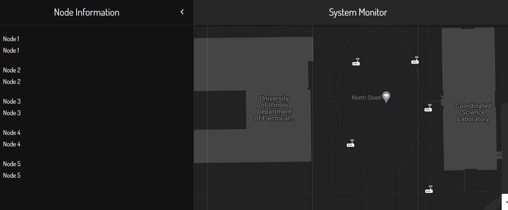
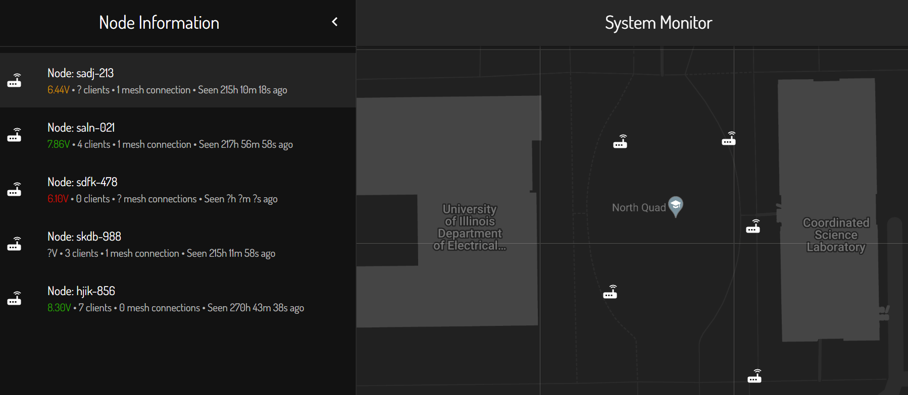
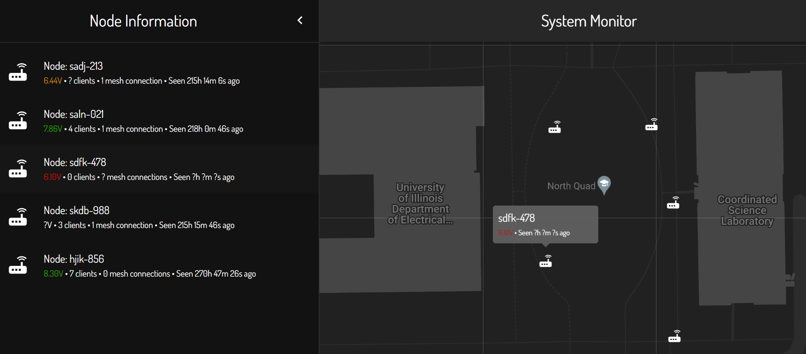

# Lab Notebook

Martin Michalski (martinm6)

### Structure

Titles are dates of meetings or workdays in which our project was worked on. Subsequent text and images
serve to describe work done, design decisions made, or group decisions made as a result of a meeting.

### 2022.08.23

First group meeting. Brainstormed and decided to develop a system for the quick setup of WiFi network.
Discussed the most likely challenges we will face during implementation.

At the conclusion of this meeting we created a post on the Web Board detailing the problem we aim to 
address and a general overview of our proposed system.

### 2022.08.25

Second group meeting. Went into more detail as to potential parts to use for the system nodes and
detailed criterion for success.

At the conclusion of this meeting, we delegated research into subsystems amongst the group members.
 - Mellisa: Sensors
 - Trevor: Battery Management
 - Martin: Routing

Later in the day, I looked into potential ways to provide wireless access to users and route traffic 
through our network, finding potential approaches:
 - Microcontroller + [ESP8266](https://www.espressif.com/en/products/socs/esp8266)
 - [Omega2](https://onion.io/omega2/)
 - [VoCore2](https://vocore.io/v2.html)

After some discussion with the group, we decided to go with one of the computers (Omega2 or VoCore2) due 
their being a bit easier to work with, and comparable in price to the microcontroller option, while
still providing pins to interface with GPS and battery voltage sensors. We chose the Omega2 over VoCore due
to a better level of community support. Price was not a factor, as both chips were rather similarily priced. 
Although we aim to build our system for as cheap as possible, we are more concerned with building a system
that is sure to work and prove our concept due to our only having one semester to complete the system.

### 2022.08.26

Third group meeting. Discussed researched parts and confirmed compatibility in our overall system 
architecture. Drafted and submitted the RFA as a group. 

### 2022.08.29

Fourth group meeting. Discussed important tasks for the week. This week, I will be focusing on:
 - CAD Assignment
 - Frontend for the system monitor

### 2022.09.01

Starting frontend development. Watching a React tutorial to refresh my
knowledge on the topic. Notes on the video can be found below.

React Notes
- Tracks page state via DOM tree, updates only the part of the page that needs updating
- Component-based UI (independent and reusable components)
- Functional components
    - Use any function format present in Javascript
    - Return JSX to render
- Props syntax example  
```javascript
    const Person = (props) => {
        return (
            <>
                <h1>Name: {props.name}</h1>
            </>
        )
    }

    const App = () => {
        return(
            <div className="App">
                <Person name='John' />
            </div>
        )
    }
```
- State in react
    - Have to import: `import { useState } from 'react'`
    - Example declaration of a component state variable: `const [counter, setCounter] = useState(0)`
        - Initial state for the variable is given to the `useState()` function
    - Call the set method as follows: `setCounter((prevCount) => prevCount - 1)`
    - Use the set function, never manipulate state directly
- Reference the [documentation](https://reactjs.org/docs/hello-world.html) for all hooks in react


JSX Notes
- `className` instead of traditional HTML `class`
- Use `{}` to inject javascript values
    - This makes component reactive to data
- `<></>` is an empty fragment
- Always start component names with capital letter

### 2022.09.02

Today I created the general layout for the frontend of the System Monitor. I made an unformatted hamburger menu, as well as
got Google Maps up and running with the styling I wanted.



Also, I met with Trevor to establish a format for the data format from the backend. This is the format for general node
metadata we settled on:

```JSON
{
    <node-id, string>: {
        "id": <node-id, string>,
        "location": {
            "lat": <node-latitude, float>, 
            "lng": <node-longitude, float>
        },
        "voltage": <node-voltage, float>,
        "lastSeen": <node-last-seen-time, unix timestamp>,
        "meshCount": <node-mesh-connections, int>
    }
}
```

We also established a format for getting statistics on "edges" between the nodes:

```JSON
    [
        {
            "ids": [
                <node-id, string>, 
                <node-id, string>
            ], 
            "strength": <connection-strength, float>
        }, ...
    ]
```

### 2022.09.03

Added mock data to the application, and styled the cards in the hamburger menu to display this new data, while including
checks for missing data. 



### 2022.09.09

Created tooltips to display node information right over the nodes icons on the map. Also created state allow 
interactions between the hamburger menu and the maps portion of the site. For example, when a node card is clicked
in the hamburger menu, the map centers on that node and displays its tooltip.



### 2022.09.11

Design validation for the hardware schema Trevor developed. Here I include notes on the circuit subsections
I had time to cover this day.

USB-C Port
- Interface with external power supply, used for the charging of our lithium-ion batteries
- On the issue of grounding, the current design includes a $0 \Omega$ resistor to our battery ground
    - Based on the [discussion](https://electronics.stackexchange.com/questions/389972/usb-shield-to-ground-or-not-to-ground) 
    linked in Trevor's notebook there no one-solution fits all, but participations mention some important considerations
        - Ground on USB slave devices may not be true ground, potentially leading to an unintended induced current between master and slave
            - This is what's referred to as a [ground loop](https://help.campbellsci.com/CR1000X/Content/shared/Maintain/Troubleshooting/ground-loops.htm#:~:text=A%20ground%20loop%20is%20a,potential%20point%20of%20the%20circuit.). This is an issue to be considered
            with our USB design, as with the resistor in place PCB ground is connected to both our local battery 0V, as
            well as the ground of the master charging device. If shielding is connected to ground in both devices, we have a ground loop.
            - The article above recommends leaving the shielding grounded only on one end of the cable
        - In an ideal world, the host should provide the shielding connection to ground, but online discussions serve to prove that
        we do not live in an ideal world
    - Based this [discussion](https://electronics.stackexchange.com/questions/4515/how-to-connect-usb-connector-shield), manufacturers
    give conflicting guidelines.
    - These points in mind, I agree with the $0 \Omega$ resistor option. This was brought up in the discussions as well. It
    affords us flexibility
- Power Specification
    - I read this [discussion](https://electronics.stackexchange.com/questions/511559/type-c-non-negotiated-power-and-20v-protection), no 
    real insight
    - Our device has a UFP (Upstream Facing Port), and will act as a current sink
    - Referring to the [USB spec](https://www.usb.org/document-library/usb-type-cr-cable-and-connector-specification-release-21), 
    Tables 4-25 and 4-24 seem to validate the discussion linked in Trevor's notebook, and the design
- Only potential issue I saw when browsing discussions is that some devices may provide 21V upon connection
    - For this POC, we will make sure to use a charger that does not do this
    - This is out-of-spec, and therefore not worth accounting for
    - We have a fuse in the case of abnormally high current drawn from the host
- NOTE: Make sure to ensure PCB traces can handle the max 15W flow from VBUS

Boost Converter (Old)
- This converter is able to handle $V_{in}$ of up to 24V, therefore the possiblilty of USB providing 24V on connection is not a concern
- Trevor's analysis of $V_{out}$ voltage ranges my independent calculations as well
- Diode selection seems to be in order, with the note that the battery charging cicuit should not draw more than 2A
- This is not the most up to date version of the boost converter
    - Refer to the next section for notes

### 2022.09.22

Implementing the backend. Below are notes written to work with MariaDB database.

Open the database console.
```
mysql -u charm_user -p
```

Opening the database of interest.
```sql
use charm_db;
```

Show all tables in the database.
```
SHOW TABLES;
```

Creation of the nodes table.
```sql
CREATE TABLE nodes (
    id CHAR(9) NOT NULL,
    readable_name VARCHAR(40) NOT NULL
);
```

Add a single row to the nodes table.
```sql
INSERT INTO nodes 
    (id, readable_name) VALUES 
    ('test-1sd4', 'Test Node #2');
```

Remove a row from the nodes table.
```sql
DELETE FROM nodes
    WHERE id='test-1sd4';
```

Creation of the telemetry table.
```sql
CREATE TABLE telemetry (
    id CHAR(9) NOT NULL,
    timestamp INT NOT NULL, 
    lat FLOAT NOT NULL,
    lon FLOAT NOT NULL, 
    voltage FLOAT, 
    clientCount TINYINT, 
    meshCount TINYINT
);
```

Add a single row to the telemetry table.
```sql
INSERT INTO telemetry
    (id, timestamp, lat, lon, voltage, clientCount, meshCount) VALUES 
    ('test-1sd4', 1663899605, 40.115041, -88.227480, 6.575421, 2, 3);
```

Altering some columns to be non-null.
```sql
ALTER TABLE telemetry
MODIFY lat
FLOAT NOT NULL;

ALTER TABLE telemetry
MODIFY lon
FLOAT NOT NULL;
```

Adding an index to the timestamp column s.t. querying for the latest telemetry is efficient.
```sql
ALTER TABLE telemetry
ADD INDEX(timestamp);
```

An interesting extension to this scheme would be the addition of a column to track the time
at which the data is received and updated in the server. This would allow for on-the-fly
latency analysis for each node.
